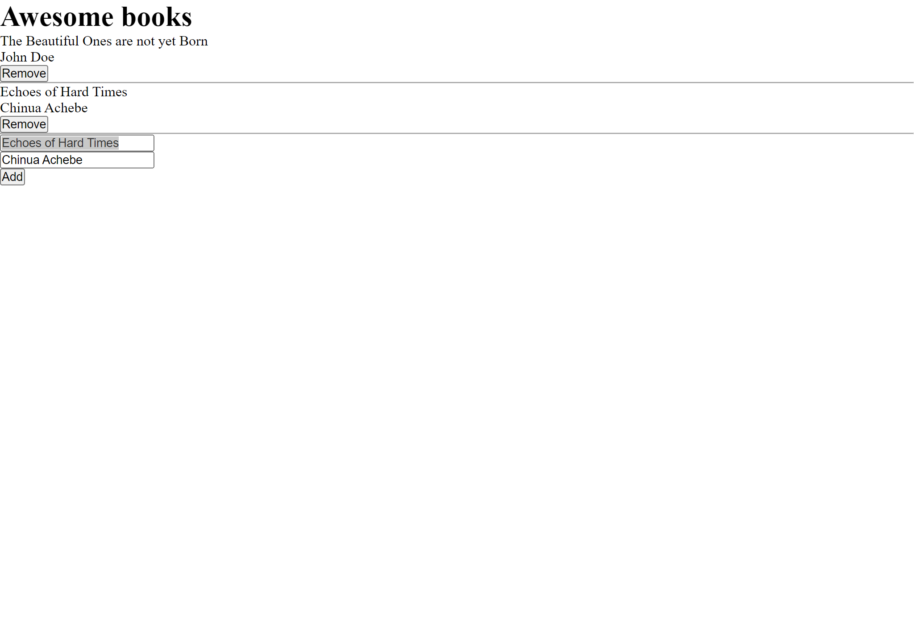

#  Awesome Book

> This is a Book Store that allows users to add and remove from a collection from books

## Built With

- HTML 
- CSS
- JS

## Live Demo
* [Demo](https://aeon9300.github.io/Awesome-Book/)

## Get a copy
- copy the url 
- Clone this project by the command `https://github.com/aeon9300/Awesome-Book.git`. 
- Open folder in your codebase
- Run the project in you browser

## Author

👤 **Adebisi Ayodele Samuel**

- GitHub: [@githubhandle](https://github.com/aeon9300)
- Twitter: [@twitterhandle](https://twitter.com/aeon9300)
- LinkedIn: [LinkedIn](https://www.linkedin.com/in/samuel-adebisi-4a589362/)

## Author

Vahan Khachvankian

- GitHub: https://github.com/Gegardus

## 🤝 Contributing

Contributions, issues, and feature requests are welcome!

Feel free to check the [issues page](../../issues/).

## Show your support

Give a ⭐️ if you like this project!

## 📝 License

This project is [MIT](./MIT.md) licensed.
=======